# Event Flow Diagrams

This document provides detailed sequence diagrams for each level of the HTF-2025 Ocean Exploration Platform.

## Complete System Overview


## Level 1: Signal Classification

The Signal Classifier is the entry point for all sonar events. It validates incoming data and determines the appropriate processing path.


### Classification Logic

The Signal Classifier uses this decision tree:

```javascript
function classifySignal(eventDetail) {
  // Check for missing required fields or explicit dark-signal type
  if (!hasRequiredFields(eventDetail) || eventDetail.type === 'dark-signal') {
    return 'dark-signal';
  }
  
  // Check intensity for alerts
  if (eventDetail.intensity >= 80) {
    return 'alert';
  }
  
  // Check for rare creatures with moderate intensity
  if (eventDetail.type === 'rare-creature' && eventDetail.intensity >= 30) {
    return 'rare-observation';
  }
  
  // Default to observation
  return 'observation';
}
```

### Example Events

**Normal Observation:**

```json
{
  "observationId": "obs-001",
  "timestamp": "2025-12-11T14:30:00Z",
  "coordinates": { "latitude": -23.5, "longitude": -45.8 },
  "depth": 1200,
  "temperature": 4.5,
  "type": "jellyfish",
  "intensity": 25,
  "description": "Bioluminescent jellyfish colony"
}
```

**High-Intensity Alert:**

```json
{
  "observationId": "alert-001",
  "timestamp": "2025-12-11T14:31:00Z",
  "coordinates": { "latitude": -23.5, "longitude": -45.8 },
  "depth": 2800,
  "temperature": 380.5,
  "type": "hydrothermal-vent",
  "intensity": 95,
  "description": "Extremely hazardous activity"
}
```

**Dark Signal:**

```json
{
  "payload": "eyJjaXBoZXIiOiJRYmJiWlhOelpXZGxJSFpwWVc0PSIsImtpZCI6ImtleS0wMDEifQ==",
  "kid": "key-001"
}
```

## Level 2: Observation Storage

The Observation Ingest Lambda subscribes to SNS with a filter for observation and alert messages.


### DynamoDB Storage

**Table Name:** `HTF25-SuperHacker-Challenge2DynamoDB-1S4KV8EJIY020`

**Schema:**

- **Primary Key:** `observationId` (String)
- **Attributes:** timestamp, coordinates, depth, temperature, type, intensity, description

**Example Stored Item:**

```json
{
  "observationId": { "S": "obs-20251211-143000" },
  "timestamp": { "S": "2025-12-11T14:30:00Z" },
  "coordinates": {
    "M": {
      "latitude": { "N": "-23.5" },
      "longitude": { "N": "-45.8" }
    }
  },
  "depth": { "N": "1200" },
  "temperature": { "N": "4.5" },
  "type": { "S": "jellyfish" },
  "intensity": { "N": "25" },
  "description": { "S": "Bioluminescent jellyfish colony detected" }
}
```

### OpenSearch Indexing

High-intensity alerts (≥ 80) are indexed in OpenSearch for:

- Real-time search and filtering
- Dashboard visualizations
- Alerting and notifications
- Historical trend analysis

**Note:** OpenSearch may have permission issues in some deployments, but the system continues to function with DynamoDB storage.

## Level 3: Rare Creature Tracking

Rare creature observations follow the same flow as normal observations but with special classification.

```mermaid
flowchart LR
    A[EventBridge Event] --> B[Signal Classifier]
    B --> C{type = 'rare-creature'<br/>AND<br/>intensity ≥ 30?}
    C -->|Yes| D[messageType=<br/>rare-observation]
    C -->|No| E[messageType=<br/>observation]
    D --> F[SNS Topic]
    E --> F
    F --> G[Observation Ingest]
    G --> H[DynamoDB Storage]
    H --> I[Available for<br/>Scientific Analysis]
```



### Rare Creature Example

```json
{
  "observationId": "rare-001",
  "timestamp": "2025-12-11T14:32:00Z",
  "coordinates": { "latitude": -15.234, "longitude": 140.678 },
  "depth": 8200,
  "temperature": 2.1,
  "type": "rare-creature",
  "intensity": 45,
  "description": "Unidentified bioluminescent organism at extreme depth"
}
```

**Special Handling:**

- Classified as `rare-observation` if intensity ≥ 30
- Enables future querying by message type
- Can trigger additional processing workflows
- Useful for marine biology research

## Level 4: Dark Signal Decryption

Dark signals are encrypted messages that require decryption using cipher keys stored in S3.


### Cipher Key Storage

**S3 Bucket:** `htf-2025-cipher-keys`  
**File:** `keys.xml`

**Format:**

```xml
<?xml version="1.0" encoding="UTF-8"?>
<keys>
  <key id="key-001">
    <cipher>
      <map from="A" to="Z"/>
      <map from="B" to="Y"/>
      <map from="C" to="X"/>
      <!-- ... more mappings ... -->
    </cipher>
  </key>
  <key id="key-002">
    <!-- Different cipher key -->
  </key>
</keys>
```

### Decryption Process


### Example Decryption

**Encrypted:**

```
Qbbb ZXNzZWdl IHZpWU0=
```

**After Base64 Decode:**

```
{
  "cipher": "Qbbb Xffbzb",
  "kid": "key-001"
}
```

**After Substitution:**

```
Dove sei
```

*("Where are you" in Italian)*

## Level 5: Message Translation

The Message Translator polls SQS for decrypted messages, detects the language, translates to English, and posts to Discord.

```mermaid
sequenceDiagram
    participant SQS as SQS Queue
    participant MT as Message Translator
    participant Comp as AWS Comprehend
    participant Trans as AWS Translate
    participant Discord as Discord Webhook
    participant CW as CloudWatch

    SQS->>MT: Poll message
    MT->>MT: Parse message body
    MT->>MT: Extract decrypted text
    
    MT->>Comp: DetectDominantLanguage
    Comp-->>MT: LanguageCode (e.g., "it")
    MT->>CW: Log detected language
    
    alt Already English
        MT->>MT: Use original text
    else Non-English
        MT->>Trans: TranslateText<br/>(SourceLang → English)
        Trans-->>MT: Translated text
        MT->>CW: Log translation
    end
    
    MT->>MT: Format Discord message
    Note over MT: Include original<br/>& translation
    
    MT->>Discord: POST webhook
    alt Success
        Discord-->>MT: 200 OK
        MT->>CW: Log webhook success
        MT->>SQS: Delete message
    else Failure
        Discord-->>MT: Error
        MT->>CW: Log webhook error
        Note over MT: Message returns to queue<br/>for retry
    end
```



### Language Detection

AWS Comprehend analyzes the decrypted text and returns:

```json
{
  "Languages": [
    {
      "LanguageCode": "it",
      "Score": 0.9876
    }
  ]
}
```

**Supported Languages:** 100+ languages including Italian, Spanish, French, German, Portuguese, etc.

### Translation

AWS Translate converts the text:

**Input:**

```
Dove sei
```

**Output:**

```
Where are you
```

### Discord Message Format

```json
{
  "content": "🔓 **Dark Signal Decrypted & Translated**\n\n**Original (Italian):** Dove sei\n**English:** Where are you\n\n*Detected language: it*",
  "username": "HTF-2025 Ocean Platform"
}
```

## Testing the Flows

We provide PowerShell scripts to test each level:

### Test All Levels

```powershell
.\test-all-levels.ps1
```

Runs complete demo of all levels in sequence.

### Test Individual Levels

```powershell
# Level 1: Normal observation
.\test-level1-observation.ps1

# Level 2: High-intensity alert
.\test-level1-alert.ps1

# Level 3: Rare creature
.\test-level3-rare-creature.ps1

# Level 4-5: Complete dark signal pipeline
.\test-level4-dark-signal.ps1
```

### Verify Results

```powershell
# Check DynamoDB data
.\test-check-dynamodb.ps1

# Check CloudWatch logs
aws logs tail /aws/lambda/HTF25-SignalClassifier --since 2m --follow
aws logs tail /aws/lambda/HTF25-ObservationIngest --since 2m --follow
aws logs tail /aws/lambda/HTF25-DarkSignalDecipherer --since 2m --follow
aws logs tail /aws/lambda/HTF25-MessageTranslator --since 2m --follow
```

## Error Handling & Retries

### Lambda Retries

- Failed Lambda executions retry automatically (2 attempts)
- After max retries, event goes to dead-letter queue (if configured)
- CloudWatch logs capture all errors

### SQS Message Handling

- Visibility timeout: 30 seconds
- Max receive count: 3
- After max receives, message moves to DLQ
- Prevents infinite retry loops

### SNS Delivery

- SNS retries failed Lambda invocations
- Exponential backoff between retries
- Max retry duration: 1 hour

### DynamoDB

- Automatic retries for throttling
- Eventually consistent reads by default
- Strong consistency available if needed

## Performance Considerations

### Cold Starts

- Node.js 20.x has ~1s cold start
- Warm Lambdas respond in <100ms
- EventBridge scheduling can keep Lambdas warm

### Throughput

- EventBridge: Unlimited events/second
- Lambda: 1000 concurrent executions (default limit)
- DynamoDB: On-demand scales automatically
- SNS/SQS: Virtually unlimited throughput

### Latency

| Component | Typical Latency |
|-----------|-----------------|
| EventBridge → Lambda | < 10ms |
| Lambda execution | 100ms - 2s |
| DynamoDB PutItem | < 50ms |
| SNS publish | < 10ms |
| SQS send/receive | < 10ms |
| Comprehend detection | 100-200ms |
| Translate API | 200-500ms |
| Discord webhook | 100-300ms |

**End-to-end:**

- Normal observation: < 2 seconds
- Dark signal pipeline: 2-4 seconds

## Monitoring & Observability

### CloudWatch Metrics

- Lambda invocations, errors, duration
- DynamoDB consumed capacity
- SQS message counts
- Custom metrics for business logic

### Structured Logging

All Lambdas use structured logging:

```javascript
console.log(JSON.stringify({
  level: 'INFO',
  message: 'Successfully stored observation',
  observationId: 'obs-001',
  timestamp: new Date().toISOString()
}));
```

### Alarms

Recommended CloudWatch alarms:

- Lambda error rate > 5%
- Lambda duration > 25s (approaching timeout)
- DynamoDB throttled requests > 0
- SQS queue depth > 100 messages

## Summary

The HTF-2025 platform demonstrates a complete event-driven serverless architecture with:

- **5 levels of complexity** from simple observations to encrypted message translation
- **Intelligent routing** using SNS message attributes
- **Decoupled processing** with SQS for fault tolerance
- **Persistent storage** in DynamoDB and OpenSearch
- **AI-powered features** with Comprehend and Translate
- **Real-time notifications** via Discord webhooks
- **Comprehensive testing** with PowerShell automation scripts

All flows are production-ready with error handling, retry logic, and structured logging.
