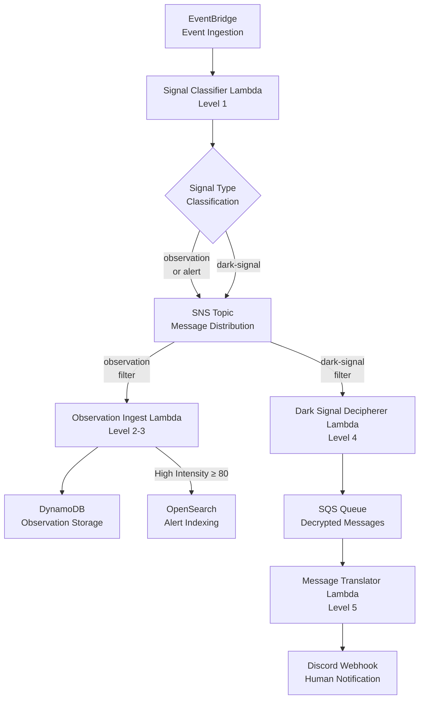

# Architecture Overview

## System Design Philosophy

This platform demonstrates **production-ready serverless architecture patterns** using AWS managed services. Every architectural decision prioritizes:

- **Loose Coupling**: Components communicate through events, not direct invocations
- **Fault Tolerance**: SQS queues and retry mechanisms prevent data loss
- **Scalability**: AWS handles scaling automatically based on load
- **Observability**: CloudWatch provides complete visibility into system behavior

## High-Level System Architecture

Our serverless ocean exploration platform processes sonar signals through a multi-stage pipeline, handling everything from normal observations to encrypted dark signals requiring decryption and translation.



## Component Responsibilities

### Level 1: Signal Classifier (Entry Point)

**Purpose**: Validate and categorize incoming sonar events

**Input**: EventBridge events from sonar devices

**Processing**:
- Validates required fields (species, location, intensity, type)
- Classifies signals based on type and intensity
- Adds message attributes for downstream routing

**Output**: SNS message with classification metadata

**Why This Design**: Single entry point ensures consistent validation and routing logic

### Level 2-3: Observation Ingest (Data Persistence)

**Purpose**: Store observations and index high-priority alerts

**Input**: SNS messages filtered by type (observation, alert, rare-observation)

**Processing**:
- Stores all observations in DynamoDB
- Indexes high-intensity alerts (≥ 80) in OpenSearch
- Handles idempotency to prevent duplicates

**Output**: Persistent records in DynamoDB and searchable alerts in OpenSearch

**Why This Design**: Dual storage provides both long-term records and real-time search capabilities

### Level 4: Dark Signal Decipherer (Decryption)

**Purpose**: Decrypt encoded messages using substitution cipher

**Input**: SNS messages filtered for dark-signals

**Processing**:
- Base64 decodes encrypted payload
- Fetches cipher key from S3 based on `kid`
- Applies character-by-character substitution
- Sends plaintext to SQS queue

**Output**: Decrypted messages in SQS queue

**Why This Design**: S3 key storage allows key rotation without code changes; SQS decouples from translation

### Level 5: Message Translator (AI Processing)

**Purpose**: Detect language and translate to English

**Input**: SQS messages containing decrypted text

**Processing**:
- Uses AWS Comprehend for language detection
- Uses AWS Translate for translation (if not English)
- Posts formatted message to Discord webhook

**Output**: Human-readable notifications in Discord

**Why This Design**: AI services handle 100+ languages without manual configuration

## Architecture Highlights

### Event-Driven Design

**Pattern**: Publish-Subscribe with EventBridge and SNS

**Benefits**:
- **Loose Coupling**: Lambdas don't know about each other
- **Extensibility**: Add new processors without changing existing code
- **Testability**: Inject events directly for testing

**Real-World Example**:
```javascript
// Signal Classifier publishes, doesn't invoke directly
await sns.publish({
  TopicArn: SNS_TOPIC_ARN,
  Message: JSON.stringify(eventData),
  MessageAttributes: {
    messageType: { DataType: 'String', StringValue: 'dark-signal' }
  }
});
```

### Infrastructure-Level Routing

**Pattern**: SNS Message Filtering

**Benefits**:
- **No routing code**: Filters defined in CloudFormation
- **AWS evaluates filters**: Happens before Lambda invocation (saves compute)
- **Declarative**: Easy to understand and modify

**Configuration**:
```yaml
# Observation Ingest subscription filter
FilterPolicy:
  messageType:
    - observation
    - alert
    - rare-observation

# Dark Signal Decipherer subscription filter
FilterPolicy:
  messageType:
    - dark-signal
```

### Decoupled Processing

**Pattern**: SQS Queue Between Stages

**Benefits**:
- **Fault Tolerance**: Messages retry automatically on failure
- **Independent Scaling**: Decryption and translation scale separately
- **Visibility**: Dead Letter Queue catches persistent failures
- **Testability**: Insert messages directly for testing

**Flow**:
```
Decryption Lambda → SQS Queue → Translation Lambda
                   ↓
            (Retries on failure)
                   ↓
            Dead Letter Queue
```

### Multi-Stage Processing

**Pattern**: Pipeline Architecture

Each Lambda has a **single, clear responsibility**:

1. **Classify** → Determine signal type
2. **Store** → Persist observations
3. **Decrypt** → Decode encrypted messages
4. **Translate** → Convert to English

**Why This Matters**:
- Easy to understand and maintain
- Each function can be optimized independently
- Failures are isolated (one stage failing doesn't break others)
- Testing is simpler (test each stage separately)

## Data Flow Patterns

### Normal Observation Flow

```
Sonar Device → EventBridge → Signal Classifier → SNS (observation)
                                                    ↓
                                         Observation Ingest → DynamoDB
```

**Latency**: ~500ms end-to-end

### High-Intensity Alert Flow

```
Sonar Device → EventBridge → Signal Classifier → SNS (alert)
                                                    ↓
                                         Observation Ingest → DynamoDB
                                                    ↓
                                                OpenSearch
```

**Latency**: ~800ms end-to-end (includes OpenSearch indexing)

### Dark Signal Flow

```
Sonar Device → EventBridge → Signal Classifier → SNS (dark-signal)
                                                    ↓
                                         Dark Signal Decipherer → S3 (fetch key)
                                                    ↓
                                                 SQS Queue
                                                    ↓
                                         Message Translator → Comprehend
                                                    ↓
                                                 Translate
                                                    ↓
                                                 Discord
```

**Latency**: ~2-3 seconds end-to-end (includes AI processing)

## Fault Tolerance & Reliability

### Retry Mechanisms

**Lambda**: Automatic retries (2 attempts)

**SQS**: Configurable visibility timeout and retry count

**SNS**: Guaranteed delivery to all subscribers

### Error Handling

**Graceful Degradation**: If OpenSearch fails, observations still stored in DynamoDB

**Dead Letter Queues**: Capture messages that fail repeatedly

**CloudWatch Alarms**: Alert on high error rates

### Idempotency

**DynamoDB**: Conditional writes prevent duplicates

**Message IDs**: Track processed messages to avoid re-processing

## Scalability Considerations

### Concurrent Execution

- **Signal Classifier**: Up to 1000 concurrent executions
- **Observation Ingest**: Scales with SNS fan-out
- **Dark Signal Decipherer**: Scales with dark signal volume
- **Message Translator**: Limited by SQS batch size (configurable)

### Cost Optimization

- **On-Demand DynamoDB**: Pay per request (no idle cost)
- **Lambda**: Pay per invocation and duration
- **SNS/SQS**: Free tier covers most hackathon usage

### Performance Tuning

- **Lambda Memory**: 256MB (balanced cost/performance)
- **Lambda Timeout**: 10 seconds (prevents runaway costs)
- **SQS Visibility Timeout**: 30 seconds (allows retry without duplicate processing)

## Security & Best Practices

### IAM Permissions

**Principle of Least Privilege**: Each Lambda has only the permissions it needs

**Example**:
- Signal Classifier: `sns:Publish`
- Observation Ingest: `dynamodb:PutItem`, `aoss:*`
- Dark Signal Decipherer: `s3:GetObject`, `sqs:SendMessage`
- Message Translator: `comprehend:DetectDominantLanguage`, `translate:TranslateText`

### Encryption

- **In Transit**: HTTPS for all AWS API calls
- **At Rest**: DynamoDB encryption enabled by default
- **Secrets**: Discord webhook URL stored as environment variable (could use Secrets Manager)

### Monitoring

**CloudWatch Logs**: Structured logging with JSON

**X-Ray Tracing**: End-to-end request tracing enabled

**Metrics**: Custom metrics for business KPIs

## Comparison with Alternative Architectures

### Why Not API Gateway + Direct Lambda Invocations?

**Our Approach**: EventBridge + SNS + Lambda

**Alternative**: API Gateway → Lambda → Lambda → Lambda

**Why EventBridge is Better**:
- Loose coupling (easier to change)
- Built-in retry and error handling
- Native event filtering
- Supports multiple event sources

### Why Not Step Functions?

**Our Approach**: Independent Lambdas with queue-based decoupling

**Alternative**: Step Functions orchestration

**Why Our Approach Works**:
- Simpler for linear pipelines
- Lower cost (no Step Function state transitions)
- Easier debugging (each stage independent)
- **Note**: Step Functions would be better for complex branching workflows

### Why Not Kinesis Streams?

**Our Approach**: SNS + SQS

**Alternative**: Kinesis Data Streams

**Why SNS/SQS Works**:
- Simpler (no shard management)
- Lower cost for our volume
- Built-in message filtering (SNS)
- **Note**: Kinesis would be better for high-throughput streaming analytics

## Next Steps

Explore detailed event flows and examples:

- [Event Flow Diagrams](./event-flow.md) - Sequence diagrams for all 5 levels
- [AWS Services Guide](./aws-services.md) - Detailed guide to each AWS service
- [Implementation Details](../implementation/level-1.md) - Code-level documentation
